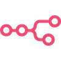

# n8n
  

 
n8n is a workflow automation platform that gives technical teams the flexibility of code with the speed of no-code. With 400+ integrations, native AI capabilities, and a fair-code license, n8n lets you build powerful automations while maintaining full control over your data and deployments.
 
 

# / Deployments

 

| Deployment               | Location           | Tags            | Status     | Url                                                              |
| ------------------------ | ------------------ | --------------- | ---------- | ---------------------------------------------------------------- |
| n8n-dev-1-vm-1 | dev-1-vm |  | **active** | https://n8n.margusm.dev/ http://192.168.40.111:5678  |

# References
-   [Github mirror](https://github.com/margusmuru/homelab-n8n)
-   [n8n Github](https://github.com/n8n-io/n8n)
-    https://n8n.io/

